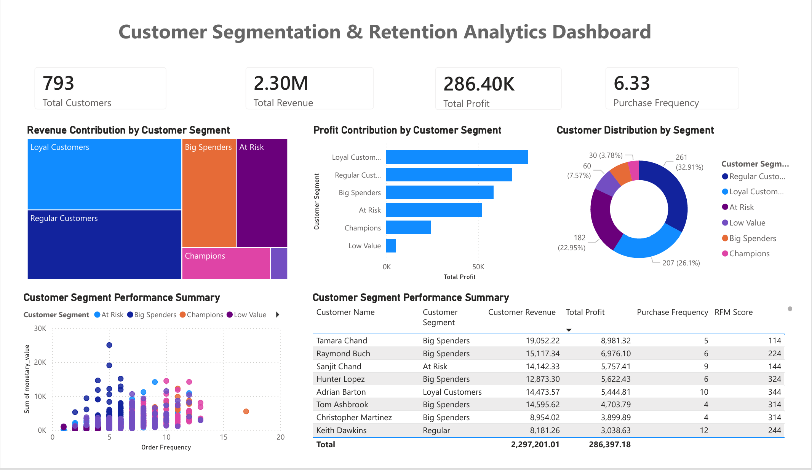

# Customer Segmentation & Retention Analytics Dashboard



## Business Problem

Organizations often struggle to understand customer behavior, identify high-value customers, and improve customer retention.

Without effective customer segmentation, businesses face challenges in:

- Identifying their most profitable customers
- Understanding purchasing patterns
- Detecting customers at risk of churn
- Allocating marketing resources effectively
- Improving customer lifetime value
- Designing targeted retention strategies

This project provides an end-to-end Customer Segmentation & Retention Analytics solution using PostgreSQL, SQL, Power BI, DAX, and Excel to analyze customer purchasing behavior and generate actionable business insights.

---

## Business Questions Answered

- Who are the most valuable customers?
- Which customer segments generate the highest revenue and profit?
- Which customers are at risk of disengagement?
- How does purchase frequency relate to customer value?
- What customer segments should receive retention-focused campaigns?
- Which customer groups contribute most to overall profitability?

---

## Key Insights

- 793 Total Customers
- £2.30M Total Revenue
- £286K Total Profit
- 6.33 Average Purchase Frequency
- Loyal Customers generate the highest overall revenue contribution
- Regular Customers represent the largest customer segment
- At-Risk Customers represent a significant revenue opportunity for retention campaigns
- Customer profitability varies considerably across segments
- Purchase frequency is strongly linked to customer value and profitability

---

## Tools & Technologies

- PostgreSQL
- SQL
- Power BI
- DAX
- Excel

---

## Dashboard Components

### Customer Segmentation Overview

Provides a high-level view of customer performance across key metrics.

**Key Capabilities**

- Total Customer Tracking
- Revenue Monitoring
- Profit Monitoring
- Purchase Frequency Analysis
- Segment-Level Performance Analysis


---

### Revenue Contribution by Customer Segment

Visualizes how revenue is distributed across customer groups.

**Insights Provided**

- Revenue concentration by segment
- Identification of high-value customer groups
- Segment contribution comparison

---

### Profit Contribution by Customer Segment

Analyzes profitability across customer segments.

**Insights Provided**

- Most profitable customer segments
- Profit contribution comparison
- Margin performance evaluation

---

### Customer Distribution Analysis

Shows the proportion of customers belonging to each segment.

**Insights Provided**

- Customer base composition
- Segment size comparison
- Customer concentration analysis

---

### Frequency vs Monetary Value Analysis

Examines the relationship between customer purchasing frequency and spending behavior.

**Insights Provided**

- High-frequency customers
- High-value customers
- Segment clustering patterns
- Customer lifetime value indicators

---

### Customer Detail Table

Provides customer-level drill-down analysis.

**Metrics Included**

- Customer Name
- Customer Segment
- Monetary Value
- Total Profit
- Order Frequency
- RFM Score

---

## Customer Segmentation Framework

Customers were segmented using RFM-style metrics and behavioral analysis.

### Segments Identified

- Loyal Customers
- Regular Customers
- Big Spenders
- Champions
- At Risk
- Low Value

This segmentation enables targeted marketing, retention strategies, and customer value optimization.

---

## Key Business Insights

- Loyal Customers contribute the largest share of revenue and profit.
- Regular Customers form the largest customer population.
- At-Risk Customers represent an opportunity for retention initiatives.
- Big Spenders generate substantial revenue despite smaller customer counts.
- Purchase frequency is a strong predictor of customer value.
- Segment-based targeting can improve marketing effectiveness and customer retention.

---

## Repository Structure

```text
Customer-Segmentation-Retention-Analytics-Dashboard/
│
├── dataset/
├── docs/
├── powerbi/
├── screenshots/
│   └── 01_Customer_Segmentation_Dashboard.png
│
├── sql/
│   ├── 01_orders_data_cleaning.sql
│   ├── 02_customer_reporting_views.sql
│   └── 03_customer_segmentation_rfm_analysis.sql
│
└── README.md
```

---

## Skills Demonstrated

- SQL Data Cleaning
- PostgreSQL Analytics
- Customer Segmentation
- RFM Analysis
- Business Intelligence Reporting
- Data Visualization
- KPI Development
- Power BI Dashboard Design
- Customer Retention Analytics
- Stakeholder Reporting

---

## Author

**Manjeet Kathuria**

MBA (Finance) | CFA Level II | Financial & Data Analytics

Specializing in Financial Analysis, Business Intelligence, SQL, Power BI, Python, and Data-Driven Decision Making.